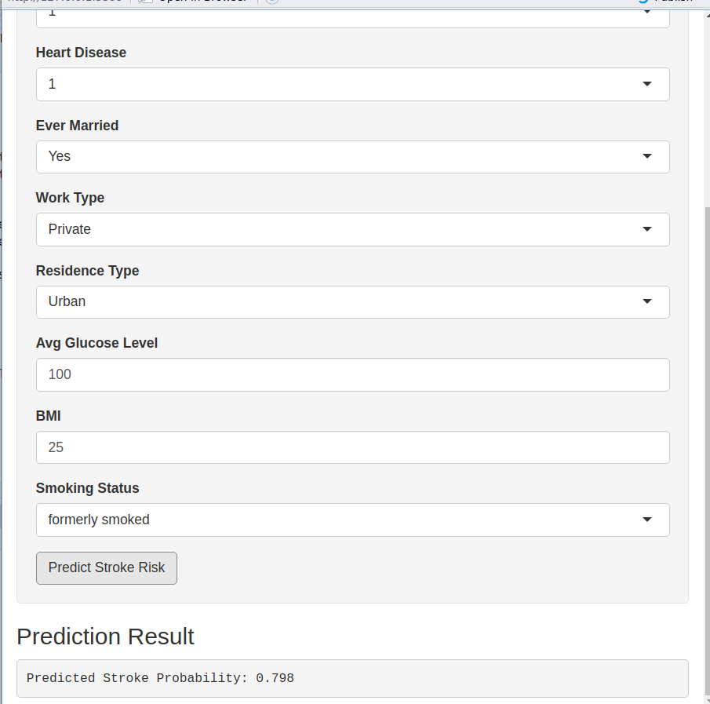

<style>
body {
  font-size: 18px;
}
</style>

# About Data Analysis Report

This RMarkdown file contains the report of the data analysis done for the project on building and deploying stroke prediction model in R. It contains data exploration, data visualization, statistical/epidemiological and predictive modeling analyses of stroke dataset. The final report was completed on `r date()`. 

**Data Description:**

According to the World Health Organization (WHO) stroke is the 2nd leading cause of death globally, responsible for approximately 11% of total deaths.

This data set is used to predict whether a patient is likely to get stroke based on the input parameters like gender, age, body mass index, various diseases, and smoking status. Each row in the data provides relevant information about the patient.


# Data Preprocessing and Analysis

**Install and load packages**

```{r message=FALSE, warning=FALSE}
### we use pacman to install and load the required packages
if (!require("pacman")) install.packages("pacman")
pacman::p_load("caret", "data.table", "DescTools", "dials", "egg", "epitools", "GGally", "ggplot2", "gridExtra", "kableExtra", "mlbench", "mltools", "naniar", "parsnip", "pROC", "ranger", "reshape2", "recipes", "rsample", "shiny", "smotefamily", "themis","tidymodels", "tune", "viridis", "workflows", "yardstick", "xgboost")

source("utils.R")

```


## Load the Data

Read the data and check its dimensions:

```{r}
dat <- as.data.frame(read.csv("healthcare-dataset-stroke-data.csv"))
cat("There are", nrow(dat), "samples and", ncol(dat), "input variables in the stroke data.")
```

What are the types of these variables?

```{r}
sapply(dat, class)
```
To this end, we can also use str function, it outputs types of column as well as an overview of some values:

```{r}
str(dat)
```

Most of the variables are categorical. We convert them into factor.

```{r warning=FALSE}

dat <- dat[, -1] ### remove the first id column

dat <- dat[dat$gender!="Other",]

dat[, -c(2, 8, 9)] <- lapply(dat[, -c(2, 8, 9)], as.factor)
  
dat$bmi <- as.numeric(dat$bmi)

```


Let us have a glimpse of the data:

```{r}

kable(head(dat), "html") %>%
  kable_styling(font_size = 12) %>%
  scroll_box(width = "100%", height = "300px")

```

## Analysis of Missing Values

To visualize the distribution of missing values we use the naniar package. 

The following plot shows that 4 percent of bmi values, or 201 of observations have bmi values missing. 

```{r miss-plot, fig.width=7, fig.height=5}
vis_miss(dat)
```

Are these missing values distributed randomly? To this end, we look at the distribution of missing values with respect to the variables of interest. For instance, regarding gender, there are more missing values for males than for females, and regarding the output variable of interest, almost ~16 percent of BMI values for stroke individuals are missing which is at most 4 percent for non-stroke individuals. So these values are missing at random.

```{r miss-distribution-plot, fig.width=15, fig.height=4}

p1 <- plot_missingness_distribution(dat, "gender")

p2 <- plot_missingness_distribution(dat, "stroke")

grid.arrange(p1, p2, ncol = 2)

```


## Visualization

### Categorical Variables

The following plot illustrates the distribution of categorical variables. 

We see that in this study there are more females than males, more ever-married individuals, more individuals working in the private sector than the remaining ones. There are almost the same number of observations in rural and urban categories. 

```{r echo=FALSE, cat-plot, fig.width=9, fig.height=9}

# Select categorical variables and stroke column
cat_vars <- dat[, -c(2, 8, 9)]
stroke <- dat$stroke

# convert into long format
long_dat <- cat_vars %>% pivot_longer(cols = everything(), names_to = "variable", values_to = "value")

# change the order of categorical variables for plot
long_dat$variable <- factor(long_dat$variable, levels = c("stroke", "gender", "hypertension",  "heart_disease", "smoking_status", "ever_married", "work_type", "Residence_type")) 

# bar plot of percentages
ggplot(long_dat, aes(x = value, y = after_stat(prop), fill=variable)) +
  geom_bar(position = position_dodge(), stat = "prop")+
  geom_text(aes(label = round(100 * after_stat(prop), 2)),
    position = position_dodge(.9), stat = "prop", vjust = -.2
  ) + 
  facet_wrap(~ variable, nrow = 2, ncol = 4, scales = "free_x") +
  scale_fill_brewer(palette = "Set2") +
  theme_minimal(base_size = 14) +
  theme(
    plot.title = element_text(hjust = 0.5, size = 16),
    axis.text.x = element_text(angle = 45, hjust = 1),
    strip.text = element_text(size = 12),
    panel.spacing = unit(1.2, "lines"),
    legend.position="none"
  ) +
  labs(
    x = "",
    y = "Proportion of observations",
    title = ""
  )

```

#### Prevalence of Stroke

We see that both females and males are equally affected by this medical condition.  There are more stroke cases among individuals with hypertension, and heart disease. More formerly-smoked individuals have stroke than the rest, however, there are a lot of individuals with the unknown smoking status, which makes this analysis biased. Age may be a confounding variable here. For instance, the majority of formerly-smoked individuals, or ever-married individuals are relatively older individuals (above the age of 40).

```{r echo=FALSE, stroke-plot, fig.width=9, fig.height=6}

# Select categorical variables and stroke column
cat_vars <- dat[, -c(2, 8, 9, 11)]  

cat_vars$stroke <- dat$stroke  

# convert to long format
long_dat <- cat_vars %>%
  pivot_longer(cols = -stroke, names_to = "variable", values_to = "value")

# stroke prevalence per category
stroke_pct <- long_dat %>%
  group_by(variable, value) %>%
  summarise(
    total = n(),
    stroke_cases = sum(stroke == 1),
    pct = round(100 * stroke_cases / total, 2),
    .groups = "drop"
  )

# set the plot order
stroke_pct$variable <- factor(stroke_pct$variable,
                              levels = c("gender", "hypertension", "heart_disease",
                                         "smoking_status", "ever_married",
                                         "work_type", "Residence_type"))


ggplot(stroke_pct, aes(x = value, y = pct, fill = variable)) +
  geom_bar(stat = "identity") +
  facet_wrap(~variable, nrow = 2, ncol = 4, scales = "free_x") +
  scale_fill_brewer(palette = "Set2") +
  theme_minimal(base_size = 14) +
  theme(plot.title = element_text(hjust = 0.5, size = 16),
        axis.text.x = element_text(angle = 45, hjust = 1),
        panel.spacing = unit(1.2, "lines"),
        legend.position = "none") +
  labs(x = "", y = "Stroke rate (%)", title = "")


```


We use **Cramer's V** to measure associations between categories in a single table. It ranges from 0 (no association) to 1 (perfect association). The following heatmap shows that there is some association between smoking status and marriage status, smoking status and work type. This is likely due to the age of individuals as a confounding variable. Most of the associations, however, are weak. 

```{r echo=FALSE}
cat_vars <- dat[, -c(2, 8, 9, 11)] %>%
  mutate(across(everything(), ~ droplevels(as.factor(.))))

cramerV_matrix <- compute_cramer_v_matrix(cat_vars)

cramerV_tidy <- melt(cramerV_matrix, na.rm = TRUE)

cramerV_tidy$Var1 <- factor(cramerV_tidy$Var1, levels = rownames(cramerV_matrix))

cramerV_tidy$Var2 <- factor(cramerV_tidy$Var2, levels = colnames(cramerV_matrix))


ggplot(cramerV_tidy, aes(Var1, Var2, fill = value)) +
  geom_tile(color = "white") +
  scale_fill_gradient2(
    low = "white", mid = "lightblue", high = "steelblue",
    midpoint = 0.2, limits = c(0, 1), name = "Cramér’s V"
  ) +
  geom_text(aes(label = round(value, 2)), color = "black", size = 3) +
  theme_minimal(base_size = 14) +
  theme(
    axis.text.x = element_text(angle = 45, hjust = 1),
    panel.grid = element_blank()
  ) +
  labs(title = "", x = "", y = "" )

```


### Continuous Variables

What about the continuous variables: age, average glucose level, and body mass index?

Half of the individuals have an average glucose level above the normal 100 mg/dL threshold, indicating a substantial proportion may be experiencing hyperglycemia. In particular, there is a cluster of individuals whose glucose levels are concentrated around ~210 mg/dL. Body mass index distribution is right skewed with more than half of the individuals having a body mass index (BMI) above the normal upper limit of 24.9 kg/m^2, i.e., half of the individuals are overweight or obese. The distribution of age is almost uniform, it includes all ages from infants to elderly.

```{r echo=FALSE, hist-plots, fig.height=4, fig.width=10, message=FALSE, warning=FALSE}

# Histogram of avg_glucose_level
p1_hist <- ggplot(dat, aes(x = avg_glucose_level)) +
  geom_histogram(fill = "#92C5DE")+
  geom_vline(xintercept = median(dat$avg_glucose_level, na.rm = TRUE),
             color = "red", linetype = "dashed", size = 0.7) +
  labs(x = "Average glucose level", y = "") +
  theme_minimal(base_size = 12)

p1_box <- ggplot(dat, aes(x = avg_glucose_level, y = 1)) +
  geom_boxplot(fill = "#92C5DE", width = 0.2, outlier.shape = NA) +
  geom_jitter(width = 0.1, height = 0.05, color = "#92C5DE", alpha = 0.1) +
  theme_minimal(base_size = 12) +
  theme(axis.title  = element_blank(),
        axis.text.y = element_blank(),
        axis.ticks.y = element_blank(),
        panel.grid.major.y = element_blank(),
        panel.grid.minor.y = element_blank())

# Combine the histogram and boxplot vertically.
p1_combined <- egg::ggarrange(p1_hist, p1_box, heights = 2:1, draw=FALSE)

# Histogram for bmi
p2_hist <- ggplot(dat, aes(x = bmi)) +
  geom_histogram(fill = "#E69F00") +
  geom_vline(xintercept = median(dat$bmi, na.rm = TRUE),
             color = "red", linetype = "dashed", size = 0.7)+
  labs(x = "Body mass index", y = "") +
  theme_minimal(base_size = 12)

p2_box <- ggplot(dat, aes(x = bmi, y = 1)) +
  geom_boxplot(fill = "#E69F00", width = 0.2, outlier.shape = NA) +
  geom_jitter(width = 0.1, height = 0.05, color = "#E69F00", alpha = 0.1) +
  theme_minimal(base_size = 12) +
  theme(axis.title  = element_blank(),
        axis.text.y = element_blank(),
        axis.ticks.y = element_blank(),
        panel.grid.major.y = element_blank(),
        panel.grid.minor.y = element_blank())

# Combine vertically
p2_combined <- egg::ggarrange(p2_hist, p2_box, heights = 2:1, draw=FALSE)

# Histogram for age
p3_hist <- ggplot(dat, aes(x = age)) +
  geom_histogram(fill = "#D6604D") +
  geom_vline(xintercept = median(dat$age, na.rm = TRUE),
             color = "red", linetype = "dashed", size = 0.7)+
  labs(x = "Age", y = "") +
  theme_minimal(base_size = 12)

p3_box <- ggplot(dat, aes(x = age, y = 1)) +
  geom_boxplot(fill = "#D6604D", width = 0.2, outlier.shape = NA) +
  geom_jitter(width = 0.1, height = 0.05, color = "#D6604D", alpha = 0.1) +
  theme_minimal(base_size = 12) +
  theme(axis.title  = element_blank(),
        axis.text.y = element_blank(),
        axis.ticks.y = element_blank(),
        panel.grid.major.y = element_blank(),
        panel.grid.minor.y = element_blank())

# Combine vertically
p3_combined <- egg::ggarrange(p3_hist, p3_box, heights = 2:1, draw=FALSE)

# -------------------------
# Arrange all three combined plots side by side
# -------------------------

grid.arrange(p1_combined, p2_combined, p3_combined, ncol = 3)


```

The distribution of average glucose level among individuals who experienced stroke is visibly multimodal, with a secondary peak above 200. The median average glucose level among stroke cases is around 105. **While individuals with average glucose levels above ~ 200mg/dL constitute a small portion of observations, they account for approximately 25% of all stroke cases,** as the following plot shows.

```{r glucose-stroke-hist, fig.height=4, fig.width=9, warning=FALSE}

p1 <- ggplot(dat, aes(x = stroke, y = avg_glucose_level, color=stroke)) + 
      geom_boxplot(outlier.shape = NA) +
      geom_jitter(width = 0.2, alpha = 0.6, size = 1.5)+
      scale_fill_brewer(palette = "Set3") +
      scale_color_brewer(palette = "Set2") +
      labs(x = "Stroke", y = "Average glucose level", color = "Stroke") +
      theme_minimal(base_size = 14) +
      theme(legend.position = "none")  


agl_means <- dat %>% group_by(stroke) %>% summarise(agl_mean = median(avg_glucose_level)) 

p2 <- ggplot(dat, aes(x=avg_glucose_level, fill=stroke)) +  geom_density(alpha=0.4) +
      geom_vline(data = agl_means, aes(xintercept=agl_mean, color=stroke), linetype="dashed")+
      labs(x = "Average glucose level", y = "Density", color = "stroke") +
      scale_fill_brewer(palette = "Set3") +
      scale_color_brewer(palette = "Set2") +
      theme_minimal(base_size = 14) 
      #+
      #theme(legend.position = "none")


grid.arrange(p1, p2, ncol=2)


```


For BMI variable there is much overlap between the stroke and non-stroke cases, but the one for stroke individuals is slightly shifted to the right.

```{r bmi-stroke-hist, fig.height=4, fig.width=10, warning=FALSE}

p1 <- ggplot(dat, aes(x = stroke, y = bmi, color=stroke)) + 
      geom_boxplot(outlier.shape = NA) +
      geom_jitter(width = 0.2, alpha = 0.6, size = 1.5)+
      scale_fill_brewer(palette = "Set3") +
      scale_color_brewer(palette = "Set2") +
      labs(x = "Stroke", y = "Body mass index", color = "Stroke") +
      theme_minimal(base_size = 14) +
      theme(legend.position = "none")  


bmi_means <- dat %>% filter(!is.na(dat$bmi)) %>%  group_by(stroke) %>% summarise(bmi_mean = mean(bmi)) 

p2 <- ggplot(dat, aes(x=bmi, fill=stroke)) +  geom_density(alpha=0.4)+
      geom_vline(data = bmi_means, aes(xintercept=bmi_mean, color=stroke), linetype="dashed")+
      labs(x = "Body mass index", y = "Density", color="stroke") +
      scale_fill_brewer(palette = "Set3") +
      scale_color_brewer(palette = "Set2") +
      theme_minimal(base_size = 14)

grid.arrange(p1, p2, ncol=2)

```

The following plots show that the age is clearly a risk factor for stroke: **75% of individuals with stroke are aged above ~60**, whereas **75% of individuals with no stroke are aged below ~60. For stroke individuals, the distribution is left skewed with half of strokes happening above the age 70.** There are no stroke cases between the ages 20 and 30 in the data, but there are 2 children with stroke. The cases involving children can be considered special cases.

```{r age-stroke-plot, fig.height=4, fig.width=9, warning=FALSE}

p1 <- ggplot(dat, aes(x = stroke, y = age, color=stroke)) + 
      geom_boxplot(outlier.shape = NA) +
      geom_jitter(width = 0.2, alpha = 0.6, size = 1.5)+
      scale_fill_brewer(palette = "Set3") +
      scale_color_brewer(palette = "Set2") +
      labs(x = "Stroke", y = "Age", color = "Stroke") +
      theme_minimal(base_size = 14) +
      theme(legend.position = "none")  


age_means <- dat %>% group_by(stroke) %>% summarise(age_mean = mean(age)) 

p2 <- ggplot(dat, aes(x=age, fill=stroke)) +  geom_density(alpha=0.4)+
      geom_vline(data = age_means, aes(xintercept=age_mean, color=stroke), linetype="dashed")+
      labs(x = "Age", y = "Density", color = "Stroke") +
      scale_fill_brewer(palette = "Set3") +
      scale_color_brewer(palette = "Set2") +
      theme_minimal(base_size = 14) +
      theme(legend.position = "none")

grid.arrange(p1, p2, ncol=2)

```

Next, we analyze pairwise relationships between these variables split based on the stroke variable (highlighted as yellow or orange). We see that individual with highly elevated glucose level are older individuals and for stroke individuals, there is a negative correlation between the age and the body mass index. This association is positive for non-stroke cases. This is because the majority of strokes happens above the age of 70, after which the body mass index starts to decline. The association between the average glucose level and body mass index is higher in stroke individuals, than it is in non-stroke individuals, this is due to the positive relationship of obesity, high glucose level and stroke.

```{r pairwise-plot, fig.height=5, fig.width=10, warning=FALSE}

ggpairs(dat, columns=c(2, 8, 9), aes(color=stroke, alpha=0.3),
        lower=list(continuous="smooth"), diag=list(continuous="densityDiag"))+
  scale_fill_brewer(palette = "Set3") +
  scale_color_brewer(palette = "Set2")
  
```

**75%** of the hypertension individuals are above the age of **~52** and **half** of the hypertension individuals are above the age of **~62**. **Stroke appears later in life, regardless of hypertension, however the hypertension individuals who experienced stroke are generally older individuals.**


```{r pairwise-age-hypertension, fig.height=5, fig.width=15, warning=FALSE}

p1 <- ggplot(dat, aes(x = hypertension, y = age, fill = hypertension)) + 
      geom_boxplot(outlier.shape = NA, position = position_dodge(0.8)) +
      geom_jitter(aes(color=hypertension), width=0.2, alpha = 0.5, size = 1.2) +
      scale_fill_brewer(palette = "Set2") +
      scale_color_brewer(palette = "Set2") +
      labs(x = "Hypertension", y = "Age", title = "Age distribution by hypertension") +
      theme_minimal(base_size = 14)+
      theme(plot.title = element_text(hjust = 0.5, size = 16))


p2 <- ggplot(dat, aes(x = hypertension, y = age, fill = stroke)) + 
      geom_boxplot(outlier.shape = NA, position = position_dodge(0.8)) +
      geom_jitter(aes(color = stroke), 
                  position = position_jitterdodge(jitter.width = 0.2, dodge.width = 0.8),
                  alpha = 0.5, size = 1.2) +
      scale_fill_brewer(palette = "Set3") +
      scale_color_brewer(palette = "Set2") +
      labs(x = "Hypertension", y = "Age", fill = "Stroke", color = "Stroke", 
           title = "Age distribution by hypertension and stroke") +
      theme_minimal(base_size = 14)+
      theme(plot.title = element_text(hjust = 0.5, size = 16))

grid.arrange(p1, p2, ncol=2)

```

The median age for heart disease is higher than that for hypertension: above 70. Similarly, **stroke appears later in life, regardless of heart disease, however there is less variability in the age distribution of individuals with heart disease and stroke: they are predominantly older.**

```{r pairwise_age_heart_disease, fig.height=5, fig.width=15, warning=FALSE}

p1 <- ggplot(dat, aes(x = heart_disease, y = age, fill = heart_disease)) + 
      geom_boxplot(outlier.shape = NA, position = position_dodge(0.8)) +
      geom_jitter(aes(color=heart_disease), width=0.2, alpha = 0.5, size = 1.2) +
      scale_fill_brewer(palette = "Set2") +
      scale_color_brewer(palette = "Set2") +
      labs(x = "Heart disease", y = "Age", title = "Age distribution by heart disease") +
      theme_minimal(base_size = 14)+
      theme(plot.title = element_text(hjust = 0.5, size = 16))


p2 <- ggplot(dat, aes(x = heart_disease, y = age, fill = stroke)) + 
      geom_boxplot(outlier.shape = NA, position = position_dodge(0.8)) +
      geom_jitter(aes(color = stroke), 
                  position = position_jitterdodge(jitter.width = 0.2, dodge.width = 0.8),
                  alpha = 0.5, size = 1.2) +
      scale_fill_brewer(palette = "Set3") +
      scale_color_brewer(palette = "Set2") +
      labs(
        x = "Heart disease",
        y = "Age",
        fill = "Stroke",
        color = "Stroke",
        title = "Age distribution by heart disease and stroke"
      ) +
      theme_minimal(base_size = 14)+
      theme(
         plot.title = element_text(hjust = 0.5, size = 18)
      )

grid.arrange(p1, p2, ncol=2)

```

The following plot shows the age distribution across combinations of hypertension and heart diseases. For instance 1_1 indicates the individuals who had both hypertension and heart disease. 

```{r pairwise_age_heartd_hypert, fig.height=5, fig.width=15, warning=FALSE}

stroke_hypert_heartd <- dat %>% mutate(hyp_hd = interaction(hypertension, heart_disease, sep = "_"))

ggplot(stroke_hypert_heartd, aes(x = hyp_hd, y = age, fill = stroke)) +
    geom_boxplot(position = position_dodge(width = 0.75), outlier.shape = NA) +
    geom_jitter(aes(color = stroke),  
                position = position_jitterdodge(jitter.width = 0.2, dodge.width = 0.75),
                alpha = 0.4, size = 1.2) +
    scale_fill_brewer(palette = "Set3") +
    scale_color_brewer(palette = "Set2") +
    labs(
      x = "Hypertension_heart disease",
      y = "Age",
      title = "Age distribution by hypertension & heart disease, split by stroke"
    ) +
    theme_minimal(base_size = 14) +
    theme(plot.title = element_text(hjust = 0.5, size = 18))


```


## Epidemiological Analysis

In this section, we do some statistical analysis of association between variables. 

### (Unadjusted) Odds Ratio

To compute the odds ratio we use **epitools package**. 
The outcome of interest is stroke, and the exposures are: hypertension, heart disease, average glucose level, age and gender.

The following odds ratio computation shows that the **odds of stroke in hypertensive individuals is ~3.7 times higher than that in non-hypertensive individuals**. 

```{r oods-ratio-hypertension}

tbl_hypertension <- table(dat$stroke, dat$hypertension)

oddsratio(tbl_hypertension)

```


Also the **odds of stroke in individuals with heart disease is ~4.71 times higher than that in individuals with no heart disease.**

```{r odds-ratio-heart-disease}

tbl_heart_disease <- table(dat$stroke, dat$heart_disease)

oddsratio(tbl_heart_disease)

```


To do odds ratio analysis with average glucose level, we bin it into two groups at the level of 180 mg/dL. **Individuals with the average glucose level >180 have ~4 times higher odds of stroke than those with the average glucose level  ≤180.**

```{r odds-ratio-glucose}

stroke_agl <- dat %>% mutate(agl_group = cut(avg_glucose_level, breaks = c(0, 180, max(dat$avg_glucose_level)))) %>% select(c(stroke, agl_group))

tbl_agl <- table(stroke_agl$stroke, stroke_agl$agl_group)

oddsratio(tbl_agl)

```


We also consider the odds ratio for body mass index, where we group the individuals into the normal weight, i.e., below 25 kg/m2, and overweight, i.e., above 25 kg/m2, categories. The result shows that **overweight individuals have ~2.24 times higher odds of stroke than those with normal weight.**

```{r body-mass-index}
dat_bmi <- dat[!is.na(dat$bmi),]

dat_bmi_stroke <- dat_bmi %>% mutate(g = cut(bmi, breaks = c(0, 25, max(dat_bmi$bmi)))) %>% select(c(stroke, g))

tbl_bmi <- table(dat_bmi_stroke$stroke, dat_bmi_stroke$g)

oddsratio(tbl_bmi)

```


**Odds of stroke in individuals aged above 60 is ~8.13 times higher than that in indivduals aged less than 60.**
Thus we see that **age is a very important risk factor**. This result is **statistically very significant, the confidence interval does not contain 1**, as the two result reported above.

```{r odds-ratio-age}

stroke_age <- dat %>% mutate(age_group = cut(age, breaks = c(0, 60, max(dat$age)), labels=c("0", "1"))) 
tbl_age <- table(stroke_age$stroke, stroke_age$age_group)

oddsratio(tbl_age)

```


Is age a confounding factor in the association between heart disease and stroke? To answer this question we use logistic regression model where we adjust for age:

```{r odds-ratio-age-confounder-heart-disease}

lr_model <- glm(stroke ~ heart_disease + age, data=dat, family = "binomial")

summary(lr_model)

exp(lr_model$coefficients)

```
**After adjusting for age, the odds ratio for stroke in individuals with heart disease decreased from 4.71 to 1.53, indicating substantial confounding by age. This suggests that age is a confounding factor in the association between heart disease and stroke.**


The same analysis holds for hypertension. **After adjusting for age, the odds ratio for stroke in individuals with hypertension decreased from 3.7 to 1.6. This suggests that age is a confounding factor in the association between hypertension and stroke.**

```{r odds-ratio-age-confounder-hypertension}

lr_model <- glm(stroke ~ hypertension + age, data=dat, family = "binomial")

summary(lr_model)

exp(lr_model$coefficients)

```


Now, how about the gender? **There is no association between gender and the occurrence of stroke.**

```{r odd-ratio-gender, message=FALSE, warning=FALSE}

tbl_gender <- table(dat$stroke, dat$gender)

oddsratio(tbl_gender)

``` 


### Attributable Risk

Since we are dealing with a cross-sectional data and risk is a time-related concept, in what follows we talk about the prevalence of disease.
What percentage of the stroke cases in the hypertension individuals can be attributed to hypertension? To answer this question we need to compute attributable risk percent: **70% of strokes in hypertension individuals could be attributed to hypertension.**

```{r attri-risk-hypertension}

total_hypert <- sum(dat$hypertension==1)
total_no_hypert <- sum(dat$hypertension==0)

stroke_no_hypertension <- sum((dat$hypertension==0) & (dat$stroke==1))
stroke_with_hypertension <- sum((dat$hypertension==1) & (dat$stroke==1))

par <- round(((stroke_with_hypertension/total_hypert)-(stroke_no_hypertension/total_no_hypert))*100 / (stroke_with_hypertension/total_hypert))

cat("Attributable risk percent due to hypertension is", par, ".")

```

What percentage of the stroke cases in individuals above the age of 60 can be attributed to their age?  **86% of strokes in individuals above the age of 60 could be attributed to their age.**

```{r attri-risk-age}

total_above_60 <- sum(stroke_age$age_group==1)
total_below_60 <- sum(stroke_age$age_group==0)

stroke_above_60 <- sum((stroke_age$age_group==1) & (dat$stroke==1))
stroke_below_60 <- sum((stroke_age$age_group==0) & (dat$stroke==1))

par <- round(((stroke_above_60/total_above_60)-(stroke_below_60/total_below_60))*100 / (stroke_above_60/total_above_60))

cat(paste0("Attributable risk percent due to being above 60 is ", par, "%."))

```

What percentage of the stroke cases in the data can be attributed to hypertension? To answer this question we need to compute population attributable risk percent. The computation below shows that only **19% of all stroke cases could be attributed to hypertension**. In a similar vein, only **14% of all stroke cases could be attributed to heart disease**.

```{r population-attri-risk-hypertension}

n <- nrow(dat)
total_stroke <- sum(dat$stroke==1)
no_hypert <- sum(dat$hypertension==0)
stroke_no_hypertension <- sum((dat$hypertension==0) & (dat$stroke==1))

no_heart_disease <- sum(dat$heart_disease==0)
stroke_no_heart_disease <- sum((dat$heart_disease==0) & (dat$stroke==1))


par <- round(((total_stroke/n)-(stroke_no_hypertension/no_hypert))*100/(total_stroke/n))
par2 <- round(((total_stroke/n)-(stroke_no_heart_disease/no_heart_disease))*100/(total_stroke/n))

cat("Population attributable risk percent due to hypertension is", par, "and population attributable risk percent due to heart disease is", par2, ".")

```


### Adjusted Odds Ratio

Logistic regression models the log odds of stroke as a linear combination of variables. It allows us to see the effect of each covariate on the odds of stroke while adjusting for all the other covariates. The result below shows that the age, average glucose level, and hypertension are significant covariates for stroke, but heart disease is not (because the age is the confounding factor), after adjusting for other variables. In other words, **older individuals, individuals with hypertension, and individuals with higher glucose levels are at increased risk of stroke.**

```{r warning=FALSE}

lr_model <- glm(stroke ~ age + gender + hypertension + heart_disease + ever_married + work_type + Residence_type + avg_glucose_level  + smoking_status, data = dat, family = "binomial")

summary(lr_model)

```

To interpret the effect of age, hypertension, and average glucose level on stroke, we need to exponentiate the coefficients. We see that **each additional year is associated with the ~7.7% increase in the odds of stroke. Each additional average glucose level is associated with the ~0.4% increase in the odds of stroke. People with hypertension have ~1.5 times the odds of stroke compared to those without hypertension.**

```{r warning=FALSE}

coeffs <- lr_model$coefficients

coeffs_sign <- coeffs[names(coeffs) %in% c("age", "hypertension1", "avg_glucose_level")]

exp(coeffs_sign)

```


# Predictive Modeling

## Evaluation Measures

This is a problem with high class imbalance: only around 5 percent of observations are stroke cases. Thus it is important to choose relevant evaluation measures. Without any learning, without even considering any input variables, predicting no stroke would achieve a very high accuracy result. Thus we concentrate on **sensitivity** and **specificity** first. **Sensitivity measures the proportion of individuals correctly identified as stroke cases among those who actually have stroke, and specificity measures the proportion of individuals correctly identified as healthy among those who are actually healthy.** These measures take values between O and 1. Now, if all individuals are predicted as non-stroke ones, then the specificity will be 1 since there is no false positives. However, sensitivity in this case will be 0, since 0 stroke case, i.e., 0 true positive is identified.

Sensitivity is also known as recall.  Precision computes the fraction of true positives in all positively predicted outputs (i.e., true and false positives). The **F1-measure** is the harmonic mean of precision and recall, it balances precision and recall. But notice that if the specificity is 1 and the sensitivity is 0, then the precision is undefined, since there is neither true positives or false positives predicted. Thus, F1 measure is not defined.

Next, we consider the **area under the ROC curve**. This curve draws sensitivity against false positive rate (1-specificity) at every cut-off threshold level for predicted probability values, and the larger the area under this curve the better the predictive performance of algorithm.

Finally, we consider **Matthews correlation coefficient. The value of this metric is computed based on the entire confusion matrix, i.e., it takes into account true positives, false positives, true negatives and false negatives. It can be considered the most suitable measure in the class-imbalance setting.**


Now, since we are dealing with the class-imbalance problem, we can choose cut-off threshold values below the standard 0.5 level. This will output different values for sensitivity, specificity, F1-measure and Matthews coefficient. Our strategy is based on the Youden's index, i.e., the threshold that maximizes sensitivity + specificity - 1.


## Missing Values, Data Splitting

We  can impute the missing values using the k-nearest neighbour method. It means that the individuals having similar characteristics will have similar body mass index. But it is questionable from precision medicine point of view. We can as well remove these individuals from the data set on the basis of biological differences between individuals even with very similar characteristics. 

We first split the data into the 70% training, 15% validation and 15% test data using rsample package of tidymodels framework. We need validations set for threshold selection. **We do stratification based on the stroke variable to ensure that the proportion of stroke cases is similar across these splits.** 
In what follow, we use set.seed to ensure reproducibility.

```{r data-split}

set.seed(123)

split1 <- initial_split(dat, prop = 0.7, strata = stroke)
dat_train <- training(split1)
dat_cv <- vfold_cv(dat_train)

temp <- testing(split1)

split2 <- initial_split(temp, prop = 0.5, strata = stroke)
dat_val <- training(split2)
dat_test <- testing(split2)
ground_truth <- factor(dat_test$stroke, levels = c(1, 0))

```


## Models  {.tabset}

We use logistic regression, also models of higher capacity, capable of learning non-linear decision boundaries, such as random forest and an improved version of the gradient boosting method, extreme gradient boosting. The latter models are particularly suitable for data with many categorical variables.

We train logistic regression with and without SMOTE, and the remaining models with SMOTE. The latter generates synthetic samples for the rare class based on the k-nearest neighbour method. The proportion of synthetic examples can be controlled thanks to the over_ratio option in the recipe function. The number of synthetic samples generated affect sensitivity and specificity: higher number of synthetic samples will improve sensitivity, and degrade specificity.

We use parsnip package of tidymodels to train logistic regression model, random forest and xgboost and we perform grid search for hyperparameter tuning.

### Logistic regression

```{r, cache=FALSE}

dat_recipe <- recipe(stroke ~ ., data = dat_train) %>% step_impute_knn(all_predictors())

lr_model <- logistic_reg() %>%  set_engine("glm") %>% set_mode("classification") 

lr_workflow <- workflow() %>% add_model(lr_model) %>% add_recipe(dat_recipe)

lr_fit <- fit(lr_workflow, data = dat_train)

#threshold selection
val_probs <- predict(lr_fit, dat_val, type = "prob")$.pred_1
val_truth <- as.factor(dat_val$stroke)

threshold_info <- best_threshold(val_truth, val_probs)
lr_thresh1 <- threshold_info$threshold

#apply to test set
lr_probs1 <- predict(lr_fit, dat_test, type = "prob")

lr_result1 <- evaluate_model_fit(lr_thresh1, ground_truth, lr_probs1$.pred_1)

```

and train with SMOTE:

```{r, cache=FALSE}

dat_smote_recipe <- recipe(stroke ~ ., data = dat_train) %>%
  step_impute_knn(all_predictors()) %>%
  step_dummy(all_nominal_predictors()) %>% 
  step_smote(stroke, over_ratio = 0.7)

lr_model2 <- logistic_reg() %>%  set_engine("glm") %>% set_mode("classification") 

lr_workflow2 <- workflow() %>% add_model(lr_model2) %>% add_recipe(dat_smote_recipe) ## use smote data recipe

lr_fit2 <- fit(lr_workflow2, data = dat_train)

#threshold selection
val_probs <- predict(lr_fit2, dat_val, type = "prob")$.pred_1

threshold_info <- best_threshold(val_truth, val_probs)
lr_thresh2 <- threshold_info$threshold

#apply to test set

lr_probs2 <- predict(lr_fit2, dat_test, type = "prob")
lr_result2 <- evaluate_model_fit(lr_thresh2, ground_truth, lr_probs2$.pred_1)

```


### Random Forest

```{r, cache=FALSE}

rf_model <- rand_forest(
  mtry = tune(),    # Number of predictors sampled at each split
  trees = tune(),   # Number of trees in the forest
  min_n = tune()    # Minimum number of data points in a node to proceed with a split
) %>% set_engine("ranger") %>% set_mode("classification")

rf_workflow <- workflow() %>%
  add_recipe(dat_recipe) %>%
  add_model(rf_model)

rf_grid <- expand.grid(
  mtry = c(2, 3, 5, 7),
  trees = c(100, 300),
  min_n = c(5, 10)
)

rf_tune_results <- rf_workflow %>% 
    tune_grid(resamples = dat_cv, 
              grid = rf_grid, 
              metrics = metric_set(roc_auc)
              )

param_final <- rf_tune_results %>% select_best(metric = "roc_auc")

rf_workflow_final <- rf_workflow %>% finalize_workflow(param_final)

rf_fit <- rf_workflow_final %>% fit(data = dat_train)

#threshold selection
rf_probs_val <- predict(rf_fit, dat_val, type = "prob")$.pred_1

threshold_info <- best_threshold(val_truth, rf_probs_val)

rf_thresh <- threshold_info$threshold

#apply to test data
rf_probs_test <- predict(rf_fit, dat_test, type = "prob")$.pred_1

rf_result <- evaluate_model_fit(rf_thresh, ground_truth, rf_probs_test)

```


### Extreme Gradient Boosting

```{r, cache=FALSE}
xgb_spec <- boost_tree(
  tree_depth = tune(),         # Maximum tree depth
  learn_rate = tune(),         # Learning rate (eta)
) %>% set_mode("classification") %>%  set_engine("xgboost", eval_metric = "auc")       

wflow <- workflow() %>% add_recipe(dat_smote_recipe) %>% add_model(xgb_spec)

# we use grid_regular() from the dials package to create a regular grid
grid_vals <- grid_regular(
  tree_depth(range = c(3, 9)),
  learn_rate(range = c(0.01, 0.3)),
  levels = 3
)

tune_res <- tune_grid(
  wflow,
  resamples = dat_cv,
  grid = grid_vals,
  metrics = metric_set(roc_auc)
)

# Collect and inspect the results.
#collect_metrics(tune_res)

# Select the best hyperparameter configuration based on auc.
best_res <- select_best(tune_res, metric="roc_auc")

# Finalize the workflow with the best parameters.
final_wflow <- finalize_workflow(wflow, best_res)

xgb_fit <- final_wflow %>% fit(data = dat_train)

#threshold selection

xgb_probs_val <- predict(xgb_fit, dat_val, type = "prob")$.pred_1

threshold_info <- best_threshold(val_truth, xgb_probs_val)

xgb_thresh <- threshold_info$threshold

#apply to test data

xgb_probs_test <- predict(xgb_fit, dat_test, type = "prob")$.pred_1

xgb_result <- evaluate_model_fit(xgb_thresh, ground_truth, xgb_probs_test)

```


## Performance Comparison of Models

**According to Matthiews correlation coefficient, all methods perform weakly (better than random)**. Their performances are comparable, but logistic regression with smote stands out in terms of AUC, F1-measure, Matthews coefficient and specificity. We see that generating synthetic examples overall improved the predictive performance of logistic regression model at the cost of sensitivity. 

```{r fig.height=4, fig.width=10}

results_df <- tribble(
  ~Model,         ~Sensitivity, ~Specificity, ~F1,       ~AUC,      ~Matthews,
  "Logistic Reg", lr_result1$sensi, lr_result1$speci, lr_result1$f1, lr_result1$aucroc, lr_result1$matcc,
  "Logistic Reg Smote", lr_result2$sensi, lr_result2$speci, lr_result2$f1, lr_result2$aucroc, lr_result2$matcc,
  "Random Forest Smote", rf_result$sensi, rf_result$speci, rf_result$f1, rf_result$aucroc, rf_result$matcc,
  "XGBoost Smote",       xgb_result$sensi, xgb_result$speci, xgb_result$f1, xgb_result$aucroc, xgb_result$matcc
)


results_long <- results_df %>% pivot_longer(cols = -Model, names_to = "Metric", values_to = "Value")


ggplot(results_long, aes(x = Metric, y = Value, fill = Model)) +
  geom_bar(stat = "identity", position = position_dodge(), width = 0.7) +
  scale_fill_brewer(palette = "Set2") +
  scale_color_brewer(palette = "Set2") +
  labs(
    title = "Performance comparison",
    y = "Value",
    x = ""
  ) +
  theme_minimal()+     
  theme(plot.title = element_text(hjust = 0.5, size = 16))

```

```{r echo=FALSE, fig.height=10, fig.width=25, warning=FALSE}

p1 <- plot_roc(data.frame(ground_truth, probs=lr_probs2$.pred_1), "Logistic Regression")

p2 <-  plot_roc(data.frame(ground_truth, probs=rf_probs_test), "Random Forest")

p3 <-  plot_roc(data.frame(ground_truth, probs=xgb_probs_test), "XGB")

grid.arrange(p1, p2, p3, ncol = 3)

```

From the confusion matrix, we see that a lot of individuals are predicted as the stroke case, since we chose lower cut-off threshold from the ROC curve. Logistic regression has smaller number of false positives.

```{r echo=FALSE, fig.height=5, fig.width=15, warning=FALSE}

p1 <- plot_confusion_matrix(ground_truth, lr_result2$pred_class, round(lr_result2$matcc, 2), "Logistic regression")

p2 <- plot_confusion_matrix(ground_truth, rf_result$pred_class, round(rf_result$matcc, 2), "Random forest")

p3 <- plot_confusion_matrix(ground_truth, xgb_result$pred_class, round(xgb_result$matcc, 2), "XGB")


grid.arrange(p1, p2, p3, ncol = 3)

```


### Incorrect Predictions of Logistic Regression

Now let us look at the distribution of incorrect predictions, in particular false positives, for logistic regression (trained with smote). We consider important predictors of stroke such as age and average glucose level. Since the age is a very important risk factor for stroke, as expected, there are many false positives for older age. There are many false positives across all values of average glucose: this is expected since the class conditional distributions of this variable, i.e., the distributions of average glucose level conditioned on the stroke variable, overlap. 

```{r incorrect-preds, fig.height=5, fig.width=15, warning=FALSE}

preds <- lr_result2$pred_class

dat_test_preds <- dat_test

dat_test_preds$preds <- factor(preds, levels=c(1,0))

dat_test_preds$outcome <- with(dat_test_preds, ifelse(
  stroke == 1 & preds == 1, "True Positive",
  ifelse(stroke == 0 & preds == 0, "True Negative",
  ifelse(stroke == 0 & preds == 1, "False Positive", "False Negative"))))


p1 <- plot_wrong_predictions(dat_test_preds, "age", "Age")

p2 <- plot_wrong_predictions(dat_test_preds, "avg_glucose_level", "Average glucose level")


grid.arrange(p1, p2, ncol=2)

```

**Positive predictive value and negative predictive value of logistic regression**

The positive predictive value (PPV) is the probability that an individual predicted to have stroke truly has stroke, while the negative predictive value (NPV) is the probability that an individual predicted not to have stroke truly does not have stroke. Considering our logistic regression model as a diagnostic tool, the probability that an individual predicted to have stroke has stroke is 17% and the probability that an individual predicted not to have stroke does not have stroke is 98%.

```{r}

cm <- confusionMatrix(lr_result2$pred_class, ground_truth, positive = "1")
metrics <- cm$byClass
ppv <- metrics[3]
npv <- metrics[4]

cat("Positive predicted value is", round(ppv,2), "and negative predicted value is", round(npv, 2))

```


# Deploy the Model

We train logistic regression model on the entire dataset, where we impute the missing values of BMI and generate synthetic examples of the rare class. We save the trained model and deploy it via shiny app.

```{r}

final_data <- dat

final_recipe <- recipe(stroke ~ ., data = final_data) %>%
  step_impute_knn(all_predictors()) %>%
  step_dummy(all_nominal_predictors()) %>% 
  step_smote(stroke, over_ratio = 0.5)


final_workflow <- workflow() %>% 
  add_model(lr_model2) %>% 
  add_recipe(final_recipe)


final_fit <- fit(final_workflow, data = final_data)

saveRDS(final_fit, file = "stroke_model.rds")

```

Use this model to predict stroke probability in shiny interface:

```{r echo=FALSE, out.width = "60%"}

```


# Findings and Conclusions

The prevalence of stroke cases is ~5%, making this a highly imbalanced dataset from a classification perspective. Data visualization revealed considerable overlap between the class-conditional distributions of important variables such as body mass index, average glucose level, heart disease, and age. This indicates that no single covariate is clearly discriminative for stroke classification. From precision medicine point of view, incorporating family history, ethnic origin, other environmental factors such as geographic location, socioeconomic status, as well as genomic profile of individuals would improve the classification of stroke cases. Importantly, since this is a cross-sectional data, although obese individuals with hypertension is a non-stroke case in the dataset, they are at higher risk of stroke as they age.

Statistical analysis showed that age is a particularly important risk factor: the majority of stroke cases occur above the age of ~60. Other important predictors are hypertension and average glucose level. In contrast, stroke occurs at similar rates across male and female individuals.

To address the class imbalance problem, we applied SMOTE to synthetically generate examples of the stroke class and we used a lower-than-standard probability threshold (less than 0.5) based in Youden's index to classify strokes. These manipulations increase model sensitivity at the cost of increased number of false positives.  We used a parametric method such as logistic regression, and tree-based models capable of learning highly non-linear decision boundaries and well adapted to data with many categorical variables: random forest and gradient boosting. All models are comparable regarding their predictive performance: they are better than a random guess according to Matthews correlation coefficient which is computed based on the whole confusion matrix. However logistic regression stood out with respect to AUC, F1 measures, Matthews correlation coefficient and specificity.

There is a clear trade-off between sensitivity and specificity: improving sensitivity results in more false positives and some false negatives. For example, adjusting the classification threshold alters the balance between these metrics. This is an important  epidemiological question: what are the consequences of generating many false positives in order to detect a rare but serious condition like stroke?


